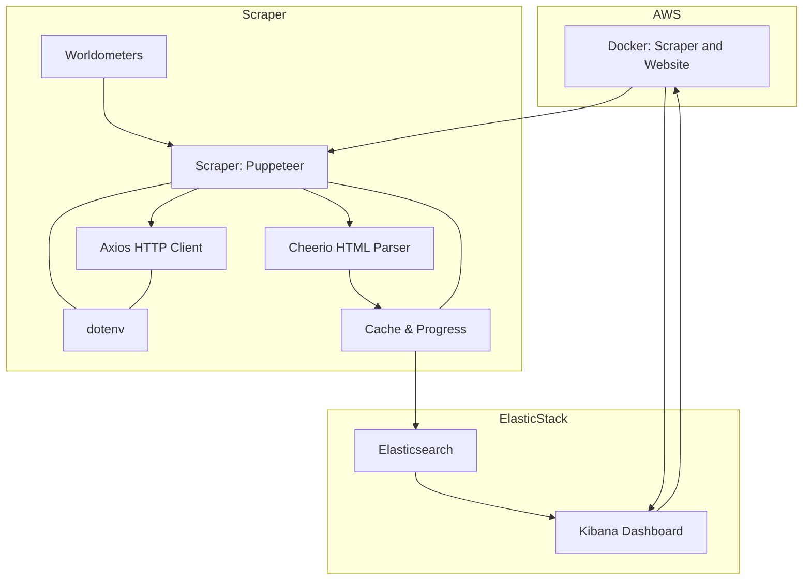

# Real-time Population Metrics Scraper & Visualization


A scalable solution for scraping real-time population data from Worldometer, storing in Elasticsearch, and visualizing through Kibana. Deployed on AWS infrastructure using Docker containers.

## ✨ Features
- **Web Scraping**: Automated data extraction from Worldometer using Puppeteer with stealth plugins
- **Data Pipeline**: Seamless integration with Elasticsearch for storage and analytics
- **Visual Dashboard**: Kibana-powered real-time visualization of global population metrics
- **Error Resilience**: Automatic screenshot capture for debugging failed scrapes
- **Cloud Ready**: Dockerized deployment on AWS EC2 instances



## 🚀 Installation
```bash
# Clone repository
git clone https://github.com/yourusername/population-scraper-node.git
cd population-scraper-node

# Install dependencies
npm install
```

# ⚙️ Configuration

### Environment Variables
Create `.env` file with the following configuration:

```env
# Elasticsearch Configuration
ELASTICSEARCH_HOST=your_elasticsearch_endpoint
ELASTICSEARCH_PORT=9200
ELASTICSEARCH_USER=your_username
```

# 🖥️ Usage
Running the Scraper

```bash
node main.js
```
### Expected Output
```plaintext
[SYSTEM]   Starting population metrics scraper v1.0

[SCRAPER]  Initializing headless browser instance...
[ELASTIC]  ✅ Connected to cluster: elasticsearch-host:9200

[SCRAPER]  🌍 World data scraped successfully (328ms)
[SCRAPER]  🔄 Processing 235 country records...

[STATS]    📊 Data pushed to index: world_population_2024-07-20
[PERF]     ⌛ Total execution time: 4.2s

```

# 🐳 Secure Elastic Stack Deployment

## Docker Configuration

### `docker-compose.yaml`
```dockerfile

version: '3.8'

x-elastic-defaults: &elastic-defaults
  image: docker.elastic.co/elasticsearch/elasticsearch:${STACK_VERSION}
  environment:
    - cluster.name=${CLUSTER_NAME}
    - bootstrap.memory_lock=true
    - "ES_JAVA_OPTS=-Xms${ES_HEAP_SIZE} -Xmx${ES_HEAP_SIZE}"
    - xpack.security.enabled=true
    - xpack.security.http.ssl.enabled=true
    - xpack.security.transport.ssl.enabled=true
  ulimits:
    memlock:
      soft: -1
      hard: -1
  networks:
    - elastic-net

services:
  setup:
    <<: *elastic-defaults
    user: root
    volumes:
      - certs:/usr/share/elasticsearch/config/certs
    command: >
      bash -c '
        if [[ ! -f config/certs/ca.zip ]]; then
          echo "Generating CA..."
          bin/elasticsearch-certutil ca --silent --pem -out config/certs/ca.zip
          unzip config/certs/ca.zip -d config/certs
        fi
        
        if [[ ! -f config/certs/certs.zip ]]; then
          echo "Generating node certificates..."
          cat > config/certs/instances.yml <<EOL
instances:
  - name: es01
    dns: [es01,localhost]
  - name: es02  
    dns: [es02,localhost]
  - name: es03
    dns: [es03,localhost]
EOL
          bin/elasticsearch-certutil cert --silent --pem -out config/certs/certs.zip \
            --in config/certs/instances.yml \
            --ca-cert config/certs/ca/ca.crt \
            --ca-key config/certs/ca/ca.key
          unzip config/certs/certs.zip -d config/certs
        fi
        
        chmod -R 750 config/certs
        find config/certs -type f -exec chmod 640 {} \;
      '

  es01:
    <<: *elastic-defaults
    hostname: es01
    depends_on:
      setup:
        condition: service_completed_successfully
    volumes:
      - certs:/usr/share/elasticsearch/config/certs
      - esdata01:/usr/share/elasticsearch/data
    environment:
      - node.name=es01
      - cluster.initial_master_nodes=es01,es02,es03
      - discovery.seed_hosts=es02,es03
      - ELASTIC_PASSWORD_FILE=/run/secrets/elastic_password
    secrets:
      - elastic_password

  kibana:
    image: docker.elastic.co/kibana/kibana:${STACK_VERSION}
    depends_on:
      es01:
        condition: service_healthy
    ports:
      - "${KIBANA_PORT}:5601"
    environment:
      - ELASTICSEARCH_HOSTS=https://es01:9200
      - ELASTICSEARCH_USERNAME=kibana_system
      - ELASTICSEARCH_PASSWORD_FILE=/run/secrets/kibana_password
      - ELASTICSEARCH_SSL_CERTIFICATEAUTHORITIES=/usr/share/kibana/config/certs/ca/ca.crt
    volumes:
      - certs:/usr/share/kibana/config/certs
    secrets:
      - kibana_password
    networks:
      - elastic-net

volumes:
  certs:
    driver: local
  esdata01:
    driver: local

networks:
  elastic-net:
    driver: bridge

secrets:
  elastic_password:
    file: ./.secrets/elastic_password
  kibana_password:
    file: ./.secrets/kibana_password

```

### `.env File`
```dockerfile
# Version
STACK_VERSION=7.17.14

# Cluster
CLUSTER_NAME=population-cluster
ES_HEAP_SIZE=1g
KIBANA_PORT=5601
```

### `Deployment Commands`
```dockerfile
# First-time setup
docker-compose up setup

# Start the stack
docker-compose up -d es01 kibana

# View logs
docker-compose logs -f
```
## 📁 Project Structure

Below is the folder and file structure for the `population-scraper-node` project. Each file and directory has been briefly explained to give insight into its purpose and functionality.

```text
population-scraper-node/
├── main.js                       # Entry point — orchestrates data scraping and Elasticsearch indexing
├── .env                          # Environment variables file
├── table-error.png               # Error screenshot: table parsing issue
├── timeout-error.png             # Error screenshot: timeout issue

├── config/
│   └── index.js                  # Configuration settings (URLs, headers, selectors, etc.)

├── elastic/
│   └── client.js                 # Elasticsearch client configuration

├── scraper/
│   ├── countryDataDynamic.js     # Scrapes country-specific population data dynamically
│   ├── utils.js                  # Helper functions for scraping and transformation
│   ├── worldData.js              # Static world population data scraper
│   └── worldDataDynamic.js       # Dynamic world population data scraper

```

---

## 🛠️ Technologies & Dependencies

This project is built using a modern JavaScript stack focused on web scraping, data handling, and Elasticsearch integration. Here's a breakdown of the core dependencies and their purposes:

| Package                                     | Purpose                                                                 |
|---------------------------------------------|-------------------------------------------------------------------------|
| **@elastic/elasticsearch** (`^7.17.14`)     | Official Elasticsearch client for Node.js                              |
| **axios** (`^1.8.4`)                        | Promise-based HTTP client for making reliable API requests             |
| **axios-retry** (`^4.5.0`)                  | Adds automatic retry functionality to axios requests                   |
| **cheerio** (`^1.0.0`)                      | Lightweight jQuery-like HTML parser for static content scraping        |
| **dotenv** (`^16.4.7`)                      | Loads environment variables from `.env` file into `process.env`        |
| **lru-cache** (`^11.0.2`)                   | In-memory caching layer for performance optimization                   |
| **progress** (`^2.0.3`)                     | Console-based progress bar during scraping or data processing          |
| **puppeteer** (`^24.4.0`)                   | Headless browser for dynamic web scraping                              |
| **puppeteer-extra** (`^3.3.6`)              | Plugin framework for Puppeteer                                         |
| **puppeteer-extra-plugin-adblocker** (`^2.13.6`) | Blocks ads and trackers during scraping, improves speed and reliability |
| **puppeteer-extra-plugin-stealth** (`^2.11.2`) | Prevents detection as a bot by evading anti-scraping techniques         |

These tools collectively enable:

- Efficient and stealthy web scraping from JavaScript-rendered websites like Worldometer  
- Smooth and retry-safe HTTP communication  
- Clean and structured data handling  
- Seamless integration with Elasticsearch for real-time analytics  

---

## 📌 Summary & Contact

This project offers a complete solution for scraping real-time population data from **Worldometer**, storing it in **Elasticsearch**, and visualizing it through interactive **Kibana dashboards**. It is fully containerized with **Docker** and deployed on **AWS EC2**, making it scalable and production-ready.

If you have any questions, suggestions, or would like to collaborate:

📧 **Email:** [ahmettkaradas@icloud.com](mailto:ahmettkaradas@icloud.com)  
🌐 **Portfolio:** [ahmetkaradas.site](https://ahmetkaradas.site)

Thank you for checking out the project! 🚀


